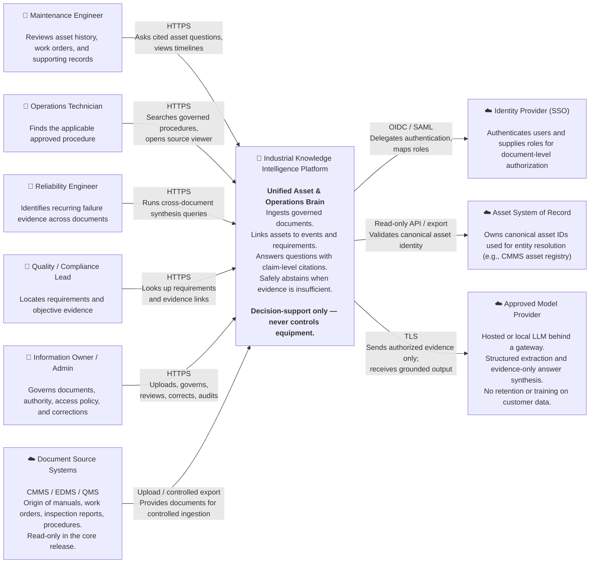

# C4 Context Diagram

**System:** Industrial Knowledge Intelligence Platform — Unified Asset & Operations Brain  
**Scope:** System landscape and external actors; decision support only, with no equipment-control path.

