# C4 Container Diagram

**System:** Industrial Knowledge Intelligence Platform — Unified Asset & Operations Brain  
**Scope:** Focused core release; decision support only. The platform never controls equipment.

```mermaid
C4Container
    title C4 Container Diagram — Industrial Knowledge Intelligence Platform

    Person(user, "Authorized Platform User", "Maintenance Engineer, Operations Technician, Reliability Engineer, or Quality / Compliance Lead")
    Person(owner, "Information Owner / Admin", "Governs documents, access, authority, corrections, and audits")

    System_Ext(idp, "Identity Provider", "SSO using OIDC or SAML; supplies identity and role claims")
    System_Ext(sor, "Asset System of Record", "CMMS or asset registry that owns canonical asset IDs")
    System_Ext(src, "Document Source Systems", "CMMS, EDMS, and QMS; controlled upload or read-only export")
    System_Ext(llm, "Approved Model Provider", "Hosted or local LLM; no customer-data retention or training")

    System_Boundary(ikip, "Industrial Knowledge Intelligence Platform") {
        Container(web, "Web Application", "Browser-based UI", "Governed search, cited Q&A, source viewer, asset profiles, uploads, review queue, and administration")

        Container(api, "Application API", "Python API service", "Authenticates requests; enforces authorization; orchestrates search, answers, governance, feedback, corrections, and audit events")

        Container(ingest, "Ingestion Workers", "Asynchronous processing", "Validates and screens files; parses or OCRs; chunks, enriches, resolves identities, and builds indexes")

        Container(retrieval, "Retrieval & Answer Service", "Hybrid retrieval and grounded generation", "Runs exact, lexical, and semantic retrieval; applies authority and applicability rules; reranks evidence; cites, discloses conflicts, or abstains")

        Container(gateway, "Model Gateway", "Approved AI boundary", "Applies model policy, evidence-only prompts, provider routing, version controls, and usage limits")

        ContainerDb(db, "Governed Knowledge Store", "PostgreSQL + vector extension", "Documents, versions, ACLs, authority, chunks, embeddings, text index, entities, relationships, reviews, provenance, and answer metadata")

        ContainerDb(objects, "Object Storage", "Approved encrypted object store", "Original files, immutable checksums, previews, thumbnails, extracted artifacts, and OCR outputs")

        Container(queue, "Processing Queue", "Implementation-neutral job queue", "Coordinates idempotent ingestion, reprocessing, correction, indexing, and deletion jobs")

        Container(obs, "Observability & Evaluation", "Central logs, metrics, traces, and evaluation store", "Captures quality, failures, access decisions, model usage, audit events, security signals, and regression results")
    }

    Rel(user, web, "Searches, asks questions, views cited evidence and asset history", "HTTPS")
    Rel(owner, web, "Uploads, governs, reviews, corrects, audits, and administers", "HTTPS")

    Rel(web, idp, "Authenticates users", "OIDC / SAML")
    Rel(web, api, "Uses platform capabilities", "HTTPS / JSON")

    Rel(api, db, "Reads and writes governed metadata, ACLs, provenance, reviews, and audit metadata", "TLS / SQL")
    Rel(api, objects, "Creates authorized upload/download links and retrieves source previews", "TLS")
    Rel(api, queue, "Submits ingestion, reprocessing, correction, and deletion jobs", "TLS")
    Rel(api, retrieval, "Requests authorized search or grounded answers", "Internal TLS")
    Rel(api, sor, "Validates canonical asset identity", "Read-only API / export")

    Rel(src, api, "Provides documents through controlled upload or export", "HTTPS")

    Rel(queue, ingest, "Dispatches processing jobs", "TLS")
    Rel(ingest, objects, "Reads originals and writes versioned extraction artifacts", "TLS")
    Rel(ingest, db, "Writes governed chunks, indexes, entities, relationships, quality flags, and provenance", "TLS / SQL")
    Rel(ingest, sor, "Resolves asset references against canonical IDs", "Read-only API / export")
    Rel(ingest, gateway, "Requests bounded structured extraction when required", "Internal TLS")

    Rel(retrieval, db, "Runs authorization-filtered exact, lexical, semantic, and relationship queries", "TLS / SQL")
    Rel(retrieval, gateway, "Sends authorized evidence for bounded answer synthesis", "Internal TLS")
    Rel(gateway, llm, "Sends minimum authorized evidence; receives structured extraction or grounded output", "TLS")

    Rel(api, obs, "Emits access, governance, feedback, correction, deletion, and audit events", "TLS")
    Rel(ingest, obs, "Emits processing quality, lineage, failure, and cost telemetry", "TLS")
    Rel(retrieval, obs, "Emits retrieval sets, citations, abstentions, versions, and evaluation signals", "TLS")
    Rel(gateway, obs, "Emits model version, policy decision, usage, latency, and provider health telemetry", "TLS")

    UpdateLayoutConfig($c4ShapeInRow="4", $c4BoundaryInRow="1")
```

## Key design rules represented

- Authorization and applicability filtering occur **before evidence reaches the model**.
- Original documents are preserved separately from governed metadata and derived artifacts.
- Retrieval combines exact identifiers, lexical matching, semantic search, and reranking.
- Generated answers are evidence-only, claim-cited, conflict-aware, and able to abstain.
- Processing is asynchronous, versioned, idempotent, reviewable, and deletion-aware.
- All external integrations are read-only or decision-support oriented; there is no equipment-control path.

## Assumption

The processing queue is shown as a logical container because the plan requires asynchronous job inspection and repeatable reprocessing. Its product or technology can be selected during implementation without changing the architecture contract.
