# Deployment Diagram

**System:** Industrial Knowledge Intelligence Platform — Unified Asset & Operations Brain  
**View:** Logical controlled-production deployment. Products, cloud provider, regions, sizing, and availability targets remain implementation decisions.

```mermaid
graph TB
    user["👤 Authorized User / Administrator<br/>Managed browser"]

    subgraph ENTERPRISE["Enterprise / Customer Network"]
        idp["Identity Provider<br/>OIDC / SAML SSO"]
        sources["Document Source Systems<br/>CMMS / EDMS / QMS<br/>Controlled export or upload"]
        assets["Asset System of Record<br/>Canonical asset registry<br/>Read-only API / export"]
    end

    subgraph PROD["Controlled Production Environment"]
        direction TB

        subgraph EDGE["Public Edge / Ingress Zone"]
            ingress["TLS Ingress<br/>WAF · rate limits · request filtering<br/>load balancing"]
        end

        subgraph APP["Private Application Zone"]
            web["Web Application<br/>Stateless replicas"]
            api["Python Application API<br/>Stateless replicas<br/>authentication · authorization · orchestration"]
            retrieval["Retrieval & Answer Service<br/>Stateless replicas<br/>hybrid search · reranking · citation · abstention"]
            workers["Ingestion Workers<br/>Horizontally scalable<br/>validation · malware checks · parsing · OCR · enrichment"]
            gateway["Model Gateway<br/>Policy enforcement · provider routing<br/>prompt/model versioning · usage limits"]
        end

        subgraph DATA["Restricted Data Zone — Private Endpoints Only"]
            queue[("Processing Queue<br/>Durable asynchronous jobs<br/>retry · dead-letter · idempotency")]
            pg[("Governed PostgreSQL Cluster<br/>metadata · ACLs · text index · vectors<br/>entities · provenance · review state<br/>primary + standby / managed HA")]
            object[("Encrypted Object Storage<br/>originals · previews · OCR and extraction artifacts<br/>versioning · immutable checksums")]
            backup[("Protected Backup Vault<br/>encrypted · access-isolated<br/>retention and tested restore")]
        end

        subgraph OPS["Operations & Security Zone"]
            secrets["Managed Secrets / Keys<br/>isolated service identities<br/>rotation and encryption keys"]
            observe["Central Observability<br/>logs · metrics · traces · evaluation<br/>audit and security alerts"]
            admin["Restricted Operations Access<br/>approved administrators<br/>deployment · rollback · reindex · restore"]
        end
    end

    subgraph MODEL["Approved Model-Processing Boundary"]
        llm["Approved Hosted or Local LLM<br/>no customer-data training<br/>approved retention and residency policy"]
    end

    subgraph NONPROD["Isolated Non-Production Environments"]
        dev["Development<br/>synthetic or approved data"]
        eval["Evaluation / Test<br/>approved benchmark and blind holdout<br/>resettable and separately authorized"]
    end

    user -->|"HTTPS"| ingress
    ingress -->|"HTTPS"| web
    web -->|"HTTPS / JSON"| api
    web -->|"OIDC / SAML"| idp

    sources -->|"Controlled HTTPS upload / export"| ingress
    api -->|"enqueue jobs"| queue
    queue -->|"dispatch / retry"| workers

    api -->|"authorized metadata and audit operations"| pg
    api -->|"authorized source preview links"| object
    api -->|"authorized query request"| retrieval

    workers -->|"read originals / write derived artifacts"| object
    workers -->|"write governed indexes and provenance"| pg
    workers -->|"validate canonical IDs"| assets
    workers -->|"bounded extraction requests"| gateway

    retrieval -->|"ACL-filtered exact, lexical, vector, and relationship queries"| pg
    retrieval -->|"authorized evidence only"| gateway
    gateway -->|"outbound TLS through approved route"| llm

    pg -->|"scheduled encrypted backup"| backup
    object -->|"policy-controlled replication / backup"| backup

    api -.->|"telemetry and audit events"| observe
    retrieval -.->|"retrieval, citation, abstention, and quality telemetry"| observe
    workers -.->|"pipeline quality, lineage, failures, and cost"| observe
    gateway -.->|"model policy, usage, latency, and provider health"| observe
    ingress -.->|"access and threat signals"| observe

    secrets -.->|"runtime identity, secrets, and keys"| ingress
    secrets -.->|"runtime identity, secrets, and keys"| api
    secrets -.->|"runtime identity, secrets, and keys"| retrieval
    secrets -.->|"runtime identity, secrets, and keys"| workers
    secrets -.->|"runtime identity, secrets, and keys"| gateway

    admin -->|"strongly authenticated restricted channel"| observe
    admin -->|"controlled deployment and recovery actions"| api
    admin -->|"policy-controlled restore operations"| backup

    dev -.->|"separate accounts, identities, data, and configuration"| eval

    classDef external fill:#f5f5f5,stroke:#666,color:#111;
    classDef edge fill:#fff3cd,stroke:#9a6700,color:#111;
    classDef app fill:#dbeafe,stroke:#2563eb,color:#111;
    classDef data fill:#dcfce7,stroke:#15803d,color:#111;
    classDef ops fill:#f3e8ff,stroke:#7e22ce,color:#111;
    classDef model fill:#ffe4e6,stroke:#be123c,color:#111;

    class user,idp,sources,assets,dev,eval external;
    class ingress edge;
    class web,api,retrieval,workers,gateway app;
    class queue,pg,object,backup data;
    class secrets,observe,admin ops;
    class llm model;
```

## Deployment controls

- Only the ingress endpoint is externally reachable; application and data workloads use private networking and service identities.
- Document authorization is enforced by the API and again during retrieval, before evidence is assembled or sent to the model.
- The model gateway is the sole approved path to the model provider and sends only the minimum authorized evidence.
- Stateless application services can scale independently; durable jobs allow safe retries and idempotent ingestion.
- PostgreSQL, object storage, queues, backups, and telemetry use encryption in transit and at rest.
- Backups are access-isolated and require tested restore procedures; deletion behavior must follow the approved retention policy.
- Development, evaluation, and production are isolated by identity, data, configuration, and deployment permissions.
- If the model provider is unavailable, the platform can degrade to authorized search and source viewing rather than generating unsupported answers.

## Decisions required before implementation

1. Approved hosting model, region, data-residency boundary, and model-provider route.
2. Availability, recovery-time, recovery-point, restore-testing, and rollback objectives.
3. Corpus size, ingestion throughput, concurrent-query load, storage growth, and scaling limits.
4. Approved OCR, malware-screening, queue, secrets, observability, and backup products.
5. Egress allow-list, administrator access path, log-redaction rules, and security-alert ownership.
