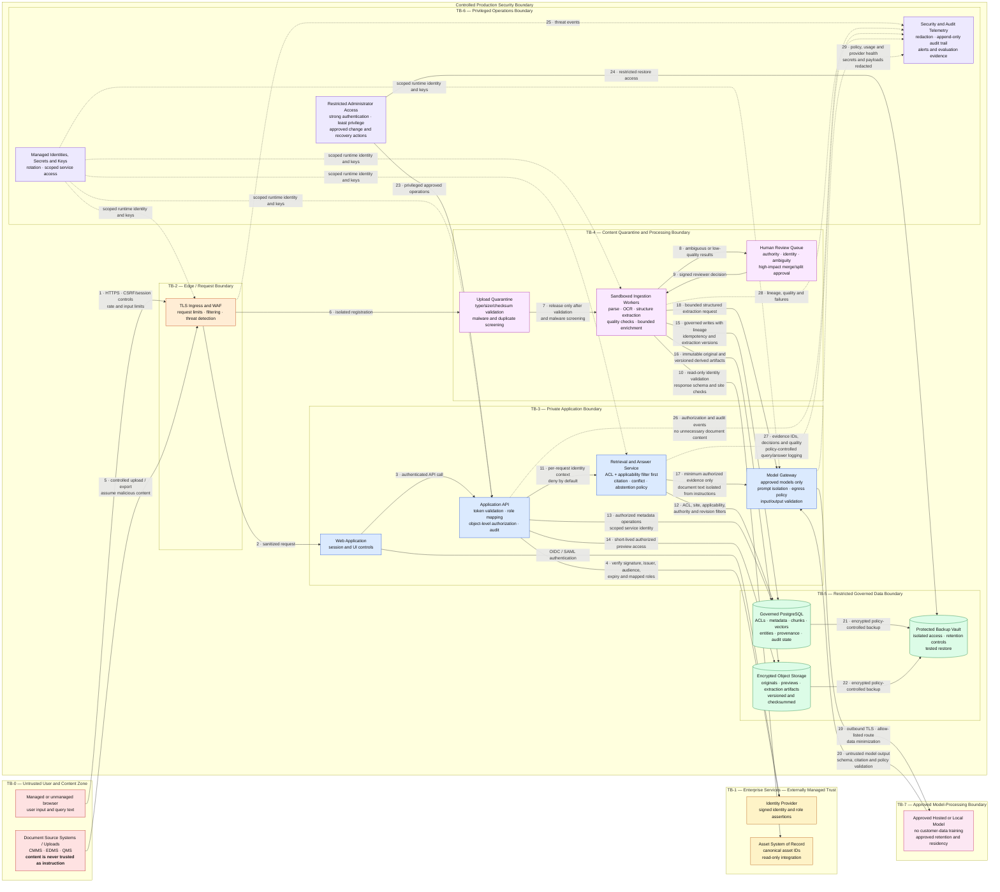

# Trust Boundary Diagram

**System:** Industrial Knowledge Intelligence Platform — Unified Asset & Operations Brain  
**View:** Logical security and data-trust boundaries. Every imported document is treated as untrusted content, even when it arrives from an approved source system.

## Boundary rules

| Boundary | Trust change | Mandatory controls |
|---|---|---|
| TB-0 → TB-2 | Untrusted client request or imported content enters the platform | TLS, WAF, request/type/size limits, rate controls, upload isolation, audit event |
| TB-1 ↔ TB-3/TB-4 | Externally managed identity and asset claims influence decisions | Signed-token verification, issuer/audience/expiry checks, controlled role mapping, read-only asset access, response validation |
| TB-2 → TB-3 | Edge-filtered traffic reaches private services | Private routing, authenticated requests, session/CSRF protection, least-privilege service identity |
| TB-2 → TB-4 | Imported content enters processing | Quarantine, checksum, duplicate and malware checks, parser isolation, hidden/adversarial-content handling |
| TB-3 ↔ TB-5 | Application reads or changes governed data | Deny-by-default document authorization, object-level ACLs, private endpoints, encryption, lineage and audit logging |
| TB-4 → TB-5 | Machine-extracted content becomes governed data | Structured schema, evidence coordinates, confidence/quality state, idempotency, versioning, human review for ambiguity |
| TB-3 → TB-7 | Authorized evidence leaves for model processing | Gateway-only egress, minimum evidence, instruction/content separation, approved provider/residency/retention, no training |
| TB-7 → TB-3 | Model output returns to the trusted application | Treat as untrusted, validate schema and citations, enforce statement labels/conflict disclosure/abstention; never execute output |
| TB-6 → all production zones | Privileged operational action crosses into runtime or data | Strong authentication, least privilege, approval and separation of duties, complete audit trail, scoped secrets |
| TB-5 → backup | Governed data enters longer-lived recovery storage | Encryption, access isolation, retention/deletion rules, restore testing and deletion verification |

## Non-negotiable security invariants

1. **Authorize before retrieval:** restricted text must not enter ranking, prompts, citations, previews, summaries, logs, or inference-visible context.
2. **Treat documents as data, never instructions:** embedded prompts, hidden text, links, or adversarial passages cannot override platform policy.
3. **Treat model output as untrusted:** only validated, evidence-supported claims may be shown; otherwise disclose conflict or abstain.
4. **Preserve provenance:** originals are not overwritten; every derivative records its source coordinates and processing versions.
5. **Separate privileges:** end users, reviewers, ingestion workers, application services, model gateway, and administrators receive distinct scoped identities.
6. **Minimize disclosure:** only necessary authorized evidence crosses the model boundary; telemetry and errors redact secrets and sensitive content.
7. **Make corrections and deletion complete:** changes propagate to facts, links, embeddings, indexes, caches, previews, histories, and backups according to approved policy.

## Decisions required before implementation

- Define network segmentation, private endpoints, egress allow-list, and whether the approved model runs inside or outside the customer-controlled environment.
- Define role-to-document policy, site scoping, reviewer privileges, emergency access, session lifetime, and administrator approval workflow.
- Select malware, file-sanitization, parser-sandbox, secrets, key-management, DLP, and security-monitoring controls.
- Approve model-provider residency, retention, training, incident-notification, and subprocessor terms.
- Define which query, evidence, answer, and audit fields may be logged and their retention/deletion periods.
