# Ingestion Pipeline Diagram

**System:** Industrial Knowledge Intelligence Platform — Unified Asset & Operations Brain  
**Purpose:** Convert untrusted industrial documents into governed, searchable, evidence-traceable knowledge through an asynchronous, idempotent pipeline.

```mermaid
graph LR
    source["Document Sources<br/>CMMS · EDMS · QMS · controlled upload"]
    register["1 · Register<br/>authenticate uploader · stable document ID<br/>file metadata · source · received time"]
    quarantine["2 · Quarantine and Screen<br/>type/size checks · checksum · duplicate check<br/>malware scan · archive and link controls"]
    govern["3 · Govern<br/>owner · authority · status · revision<br/>applicability · ACL · retention class"]
    route{"4 · Digital text<br/>available and usable?"}
    parse["5A · Direct Parse<br/>text · headings · tables<br/>page/section coordinates"]
    ocr["5B · OCR Route<br/>render pages · OCR · layout/table extraction<br/>page coordinates and confidence"]
    cad["5C · CAD Route<br/>magic-byte detect · sandboxed handler<br/>tessellate · PMI · properties · part cards<br/>CAD entity coordinates · tiered by recoverability"]
    normalize["6 · Normalize and Structure<br/>clean without losing meaning<br/>preserve headings, tables, units, and coordinates"]
    quality{"7 · Extraction quality<br/>meets threshold?"}
    review["Human Review Queue<br/>malware exception · missing governance<br/>poor OCR · ambiguity · authority review"]
    chunk["8 · Semantic Chunking<br/>procedure steps · sections · table context<br/>stable chunk IDs and lineage"]
    enrich["9 · Bounded Enrichment<br/>assets · components · events · actions<br/>requirements · evidence spans"]
    schema{"10 · Schema and<br/>evidence validation pass?"}
    resolve["11 · Entity Resolution<br/>canonical asset ID · site · aliases<br/>deterministic rules before model assistance"]
    identity{"12 · Identity confidence<br/>and impact acceptable?"}
    index["13 · Governed Indexing<br/>metadata · lexical index · vectors<br/>approved relationships · provenance"]
    publish["14 · Publish Authorized Version<br/>searchable only under ACL, status,<br/>authority and applicability policy"]
    evaluate["15 · Post-Ingestion Checks<br/>sample citations · retrieval tests<br/>counts · drift · cost · security signals"]
    ready["Ready for Authorized Retrieval"]
    failed["Rejected / Isolated<br/>not searchable · reason recorded"]
    store[("Encrypted Object Storage<br/>immutable original · previews<br/>OCR and extraction artifacts")]
    db[("Governed Knowledge Store<br/>documents · versions · chunks · entities<br/>ACLs · reviews · provenance")]
    queue[("Durable Processing Queue<br/>retry · dead letter · idempotency")]
    sor["Asset System of Record<br/>canonical IDs · read-only"]
    obs["Audit, Quality and Operations Telemetry"]

    source --> register --> quarantine
    quarantine -->|"clean and permitted"| govern
    quarantine -->|"malicious, prohibited, or irrecoverable"| failed
    register -->|"store immutable original"| store
    govern -->|"enqueue versioned job"| queue
    queue --> route
    route -->|"yes"| parse
    route -->|"no / scanned"| ocr
    route -->|"CAD / mesh geometry"| cad
    parse --> normalize
    ocr --> normalize
    cad --> normalize
    cad -->|"toolkit unavailable · needs conversion · parse error"| review
    parse -->|"versioned artifact"| store
    ocr -->|"versioned artifact"| store
    cad -->|"canonical mesh · previews · artifacts"| store
    normalize --> quality
    quality -->|"no"| review
    quality -->|"yes"| chunk
    review -->|"approved correction / metadata"| queue
    review -->|"reject"| failed
    chunk --> enrich --> schema
    schema -->|"no"| review
    schema -->|"yes"| resolve
    resolve -->|"read-only identity validation"| sor
    resolve --> identity
    identity -->|"ambiguous or high-impact merge/split"| review
    identity -->|"approved"| index
    index --> db
    index --> store
    index --> publish --> evaluate --> ready
    evaluate -->|"gate fails"| review

    register -.-> obs
    quarantine -.-> obs
    normalize -.-> obs
    review -.-> obs
    index -.-> obs
    evaluate -.-> obs

    classDef untrusted fill:#fee2e2,stroke:#b91c1c,color:#111;
    classDef process fill:#dbeafe,stroke:#1d4ed8,color:#111;
    classDef decision fill:#fef3c7,stroke:#b45309,color:#111;
    classDef review fill:#fae8ff,stroke:#a21caf,color:#111;
    classDef data fill:#dcfce7,stroke:#15803d,color:#111;
    classDef terminal fill:#e0f2fe,stroke:#0369a1,color:#111;

    class source untrusted;
    class register,quarantine,govern,parse,ocr,cad,normalize,chunk,enrich,resolve,index,publish,evaluate process;
    class route,quality,schema,identity decision;
    class review,failed review;
    class store,db,queue data;
    class ready terminal;
```

## Pipeline controls

- Each document version is processed under a stable ID, checksum, pipeline version, and idempotency key.
- Originals are immutable; OCR, parsing, chunking, embeddings, and enrichment artifacts are independently versioned.
- No content is searchable until governance metadata, authorization, source coordinates, and release checks are complete.
- Poor extraction, unsupported relationships, uncertain authority, and ambiguous identity are routed to review rather than silently accepted.
- Reprocessing writes a new governed derivative set and safely replaces active index references without duplicating facts.
- A failed or malicious file remains isolated and cannot enter retrieval, previews, prompts, or generated answers.

## Route 5C · CAD and mesh geometry

CAD and mesh files take a dedicated route because their "text" is geometry, structure, and PMI rather than prose.

- **Detection is by magic bytes, not extension.** Quarantine reads the leading bytes and asks the extraction registry (`services/ingestion/.../extract/registry.py`) which handler recognizes the file. A mislabeled or hostile extension cannot smuggle content past the gate; an unrecognized binary is rejected.
- **Handlers run in a sandbox.** Extraction of untrusted geometry runs behind `extract/sandbox.py`. Any exception, timeout, or missing-toolkit condition becomes a *routed outcome*, never a worker crash. (Process-local isolation today; true OS/container isolation is Phase 4 hardening — the seam is in place.)
- **Tiered by recoverability.** `full_geometry` (STEP, STL — B-rep/mesh read, canonical mesh + metrics), `metadata_only` (proprietary parts with no neutral geometry — Phase 2), `needs_conversion` (convert to a neutral format then re-ingest — Phase 4), `blocked` (policy). A file we cannot read *here* (e.g. the OCCT toolkit is not installed) routes to **review**, not rejection, so enabling the toolkit later recovers it.
- **Chunking is structure-aware (§B).** Each part yields a **part card** (name, part number, tier, format, and geometry metrics — bbox, volume, area, watertightness) as the primary retrievable text, plus one chunk per **PMI** note and a **properties** chunk. A plain text query can surface a part through the existing semantic channel with no retrieval-side change.

### CAD `source_coordinates`

CAD chunks cite the exact geometric entity they came from, using the CAD form of `provenance.source_coordinates`:

- `cad_entity_type` — `solid` \| `face` \| `edge` \| `pmi` \| `property` \| `part`
- `cad_entity_id` — kernel handle / persistent id where the format exposes one
- `cad_part_ref` — owning part within an assembly
- `cad_label` — human-facing feature/property name

The validation gate rejects a geometric chunk (`part_card`, `pmi`) that lacks CAD coordinates, so no geometric claim is written un-anchored. Extraction provenance is recorded in `processing_versions` (`geometry_kernel`, `tessellation`, `extraction_tier`) so any CAD artifact can be reproduced or invalidated when a handler version changes.
