# Data Lifecycle Diagram

**System:** Industrial Knowledge Intelligence Platform — Unified Asset & Operations Brain  
**Scope:** Lifecycle of source documents, derived knowledge, query records, corrections, supersession, retention, backup, and verified deletion.

```mermaid
graph LR
    receive["1 · Receive<br/>controlled upload or export"]
    quarantine["2 · Quarantine<br/>untrusted and not searchable"]
    registered["3 · Registered Original<br/>stable ID · checksum · owner<br/>retention and ACL assigned"]
    processing["4 · Versioned Processing<br/>parse/OCR · normalize · chunk<br/>enrich · resolve · validate"]
    review["5 · Governed Review<br/>authority · quality · identity<br/>applicability · access"]
    active["6 · Active Governed Version<br/>authorized retrieval and source viewing"]
    use["7 · Controlled Use<br/>search · cited answer · asset profile<br/>evaluation and audit event"]
    change{"8 · Lifecycle Event"}
    correct["Correction<br/>reviewed change with rationale<br/>affected artifacts identified"]
    reprocess["Reprocess<br/>new parser/model/schema version<br/>or corrected metadata/content"]
    supersede["Supersede / Withdraw<br/>new active revision or revoked authority<br/>prior provenance retained by policy"]
    archive["Archive / Inactive Retention<br/>not used for current guidance<br/>restricted historical access"]
    expire["Retention Expiry or<br/>Authorized Deletion Request"]
    plan["Deletion Plan<br/>authorize scope · legal/record hold check<br/>enumerate source and derivatives"]
    purge["Purge Active Data<br/>originals · previews · OCR · chunks<br/>embeddings · indexes · relations · caches"]
    history["History Treatment<br/>answers · feedback · evaluations · logs<br/>delete, redact, or retain minimum audit metadata"]
    backup["Backup Expiry Handling<br/>cryptographic erasure or scheduled expiry<br/>prevent ordinary restore of deleted data"]
    verify["Deletion Verification<br/>search tests · artifact inventory<br/>backup-policy confirmation · signed result"]
    tombstone["Minimal Deletion Record<br/>scope · authority · time · verification<br/>no prohibited source content"]
    reject["Rejected / Failed Version<br/>isolated, not searchable<br/>retained or deleted by policy"]

    original[("Original Object<br/>immutable and checksummed")]
    derived[("Derived Artifacts<br/>text · OCR · chunks · embeddings<br/>entities · relationships · previews")]
    metadata[("Governance and Provenance<br/>ACL · authority · revision · lineage<br/>reviews · processing versions")]
    audit[("Audit and Evaluation Records<br/>access decisions · evidence IDs<br/>answer/config versions · feedback")]
    vault[("Protected Backup Vault<br/>isolated access · retention schedule")]

    receive --> quarantine --> registered --> processing --> review
    review -->|"approved"| active
    review -->|"rejected or unrecoverable"| reject
    active --> use --> change

    registered --> original
    processing --> derived
    review --> metadata
    use --> audit

    change -->|"approved correction"| correct --> reprocess --> processing
    change -->|"new revision"| supersede
    change -->|"withdrawal / inactive period"| archive
    change -->|"retention expiry or authorized request"| expire

    supersede --> archive
    supersede -->|"replacement version"| processing
    archive -->|"reactivation requires review"| review
    archive -->|"retention expiry"| expire
    reject -->|"retention expiry or immediate policy"| expire

    original -->|"encrypted policy backup"| vault
    derived -->|"encrypted policy backup"| vault
    metadata -->|"encrypted policy backup"| vault
    audit -->|"policy-controlled backup"| vault

    expire --> plan
    plan -->|"hold exists"| archive
    plan -->|"authorized to delete"| purge
    purge --> history
    history --> backup
    backup --> verify
    verify -->|"complete"| tombstone
    verify -->|"residual artifact found"| purge

    classDef intake fill:#fee2e2,stroke:#b91c1c,color:#111;
    classDef process fill:#dbeafe,stroke:#1d4ed8,color:#111;
    classDef governed fill:#dcfce7,stroke:#15803d,color:#111;
    classDef decision fill:#fef3c7,stroke:#b45309,color:#111;
    classDef inactive fill:#f3f4f6,stroke:#4b5563,color:#111;
    classDef deletion fill:#fae8ff,stroke:#a21caf,color:#111;
    classDef data fill:#e0f2fe,stroke:#0369a1,color:#111;

    class receive,quarantine intake;
    class registered,processing,review,reprocess process;
    class active,use,correct governed;
    class change decision;
    class supersede,archive,reject inactive;
    class expire,plan,purge,history,backup,verify,tombstone deletion;
    class original,derived,metadata,audit,vault data;
```

## Lifecycle rules

1. The immutable original and each derivative have separate identities, versions, checksums, and retention treatment.
2. Only an approved active version participates in current-guidance retrieval; historical versions remain visibly superseded or withdrawn.
3. Every answer records the exact authorized evidence IDs and processing/model configuration used, subject to logging and retention policy.
4. Corrections identify and regenerate affected chunks, embeddings, facts, relationships, previews, caches, and future answers.
5. Deletion begins only after authority and hold checks and covers originals, derivatives, indexes, relationships, histories, and backup behavior.
6. A deletion is not complete until residual-artifact tests pass and a minimal, policy-permitted verification record is created.
7. Restoring a backup must replay deletion records before the restored environment is made available.
